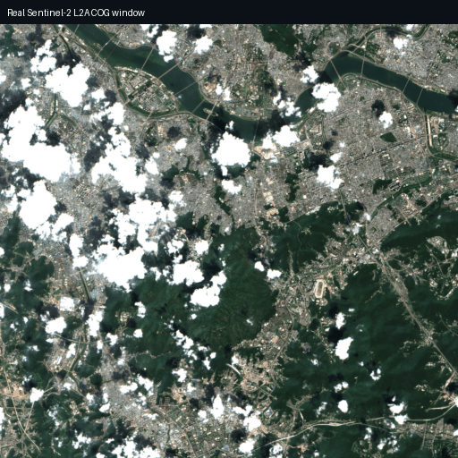
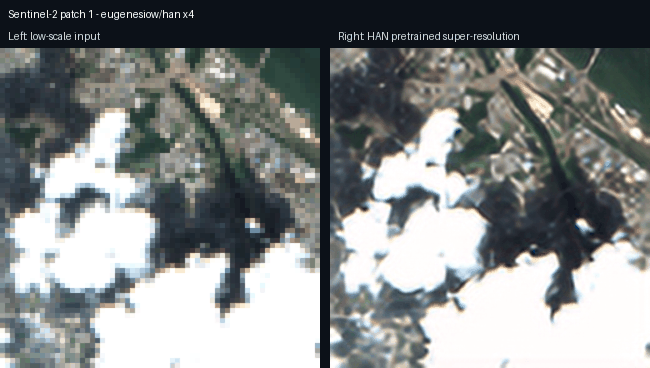
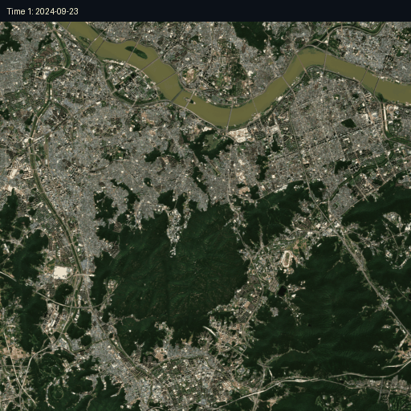

# satprep

위성영상 딥러닝 워크플로우를 위한 **위성영상 전처리, 품질 분석, 해상도 향상, 다중시기 합성 라이브러리**입니다.

`satprep`은 큰 GeoTIFF 또는 Cloud Optimized GeoTIFF(COG) 위성영상을 딥러닝 학습에 쓰기 좋은 칩 단위 데이터셋으로 변환하고, 각 칩의 품질을 분석한 뒤, 학습에 적합한 칩만 선별할 수 있도록 돕습니다. 이 프로젝트는 모델 학습 프레임워크가 아니라 **학습 전 데이터 준비와 품질 관리에 집중한 전처리 라이브러리**입니다.

## 핵심 목적

위성영상 딥러닝에서는 원본 영상이 너무 크고, 구름, 그림자, 흐림, nodata 영역, 낮은 선명도 같은 문제가 섞여 있는 경우가 많습니다. `satprep`은 이런 문제를 다음 흐름으로 처리합니다.

```text
대형 위성영상 입력
  ↓
지리공간 메타데이터 보존
  ↓
격자 기반 칩 생성
  ↓
칩별 품질 분석
  ↓
usable / warning / reject 분류
  ↓
JSON / CSV 리포트 저장
  ↓
학습용 데이터셋으로 필터링
  ↓
필요 시 업스케일링, 초해상도, 다중시기 합성 적용
```

## 데모 개요


데모에는 실제 [Sentinel-2 L2A Cloud Optimized GeoTIFF](https://registry.opendata.aws/sentinel-2-l2a-cogs/) 데이터를 사용했습니다. 
데이터 검색은 [Element 84 Earth Search STAC API](https://earth-search.aws.element84.com/v1)를 통해 수행합니다.

이 데모는 작은 패치 데이터셋이 아니라 **큰 원본 위성영상에서 필요한 부분만 읽고 직접 칩으로 자르는 실제 대형 래스터 처리 흐름**을 보여줍니다.

현재 README 데모에 사용된 대표 장면:

- Dataset: Sentinel-2 L2A Cloud Optimized GeoTIFF
- STAC collection: `sentinel-2-l2a`
- Item: `S2B_52SCG_20240819_0_L2A`
- Local demo window: `2048 x 2048`
- Chip size: `512 x 512`
- Generated chips: `16`

## 데모 1. Grid Tiling And Quality Control



이 데모는 `satprep`의 가장 중요한 기능인 **대형 위성영상 칩 생성과 칩 품질 분류** 결과를 보여줍니다.

### 내부 처리 흐름

1. Earth Search STAC API에서 Sentinel-2 L2A item을 검색합니다.
2. 선택된 item의 true-color `visual` COG URL을 가져옵니다.
3. `rasterio` window read로 `2048 x 2048` 영역만 읽습니다.
4. 읽은 window를 로컬 GeoTIFF로 저장합니다.
5. CRS, affine transform, 해상도, dtype, band metadata를 유지합니다.
6. `GridTiler(chip_size=512, stride=512)`로 16개 칩을 생성합니다.
7. 각 칩을 GeoTIFF로 저장하고, 칩별 JSON metadata를 생성합니다.
8. 각 칩에 대해 품질 지표를 계산합니다.
9. 품질 지표를 기준으로 `usable`, `warning`, `reject` 상태를 부여합니다.
10. 결과를 `quality_report.json`, `quality_report.csv`로 저장합니다.

현재 데모 결과:

```text
total_chips: 16
usable_chips: 8
warning_chips: 8
rejected_chips: 0
```

이 예시는 흰색/검은색 블록을 인위적으로 만든 극단적인 toy example이 아닙니다. 실제 Sentinel-2 장면에서 구름처럼 밝은 영역, 그림자처럼 어두운 영역, 도시/산림/하천의 질감 차이를 이용해 품질을 분류합니다.

### 사용하는 주요 품질 지표

- `blur_score`: Laplacian 기반 흐림 점수
- `sharpness_score`: Sobel gradient 기반 선명도 점수
- `entropy_score`: Shannon entropy 기반 정보량
- `nodata_ratio`: nodata 또는 빈 픽셀 비율
- `mean_brightness`: 평균 밝기
- `saturation_ratio`: 포화 픽셀 비율
- `cloud_score`: 밝고 흰색에 가까운 구름 후보 비율
- `shadow_score`: 매우 어두운 그림자 후보 비율
- `object_visibility_score`: 위 지표들을 조합한 객체 가시성 점수

## 데모 2. Classical And Deep Super-Resolution



이 데모는 저해상도 위성 이미지를 초해상도(super-resolution) 기법으로 복원하는 흐름을 보여줍니다.  
왼쪽은 low-resolution input 이미지이며, 오른쪽은 `satprep`이 super-resolution 모델을 통해 복원한 결과입니다.

`satprep`은 딥러닝 기반 초해상도 모델을 모듈 형태로 지원하며, 사용자는 목적에 따라 다양한 pretrained 모델을 선택하여 적용할 수 있습니다.

### 사용 가능한 모델 예시

현재 데모에서는 Hugging Face 모델인  
[eugenesiow/han](https://huggingface.co/eugenesiow/han?utm_source=chatgpt.com) 을 사용합니다.

- 모델명: HAN (Holistic Attention Network)
- 논문: *Single Image Super-Resolution via a Holistic Attention Network*
- 라이브러리: `super-image`
- 사용 checkpoint: `pytorch_model_4x.pt`
- 지원 scale: 현재 README 데모는 `x4` 기준

### 모델 확장성

`satprep`의 super-resolution pipeline은 특정 모델에 종속되지 않도록 설계되었습니다.

따라서 향후 아래와 같은 다양한 딥러닝 기반 초해상도 모델로 확장 가능합니다.

- EDSR
- ESRGAN / Real-ESRGAN
- SwinIR
- RCAN
- HAT
- LIIF
- Diffusion-based SR models

사용자는 목적에 따라:
- 복원 품질 중심
- 속도 중심
- 실제 위성 영상 복원 특화
- 노이즈 제거 포함 복원

등의 다양한 모델을 선택하여 적용할 수 있습니다.

### 내부 처리 흐름

1. Sentinel-2 `2048 x 2048` window에서 여러 패치를 선택합니다.
2. 각 패치를 일부러 작은 low-scale input으로 축소합니다.
3. `create_super_resolution_model("han", scale=4)`로 HAN wrapper를 생성합니다.
4. `super-image`가 Hugging Face에서 pretrained HAN checkpoint를 로드합니다.
5. low-scale input을 HAN 모델에 넣어 x4 super-resolution 결과를 생성합니다.
6. GIF에서는 왼쪽에 low-scale input, 오른쪽에 HAN 결과를 배치합니다.

사용 예시:

```python
from satprep.restoration.super_resolution import create_super_resolution_model

model = create_super_resolution_model("han", scale=4)
result = model.predict(chip_array)
```

CLI 사용 예시:

```bash
satprep super-resolve input.tif --model han --scale 4 --out sr.tif
```


## 데모 3. Multi-Temporal Composite



이 데모는 같은 지역을 여러 날짜에 촬영한 Sentinel-2 영상으로 더 깨끗한 합성 영상을 만드는 과정을 보여줍니다.

이 데모는 다음을 보여줍니다.

- 같은 Sentinel-2 tile에서 여러 날짜 item을 선택
- 동일한 픽셀 window를 각 날짜에서 읽기
- `(time, band, height, width)` 형태로 stack 생성
- 단순 median보다 더 밝고 구름이 적은 clear-sky quality mosaic 생성

### 사용한 합성 방법

 RGB 기반 휴리스틱으로 각 날짜의 같은 위치 픽셀을 비교하여 처리합니다.

- 너무 밝고 흰색에 가까운 픽셀은 구름 후보로 보고 감점
- 너무 어두운 픽셀은 그림자 후보로 보고 감점
- 적당히 밝고 색 대비가 살아 있는 픽셀을 선호
- 모든 날짜가 구름 후보인 경우에는 median fallback 사용
- 최종 결과에는 약간의 밝기 보정 적용


```text
median 평균 밝기: 97.97
clear-sky 평균 밝기: 111.90

median cloud-like bright pixel ratio: 0.060
clear-sky cloud-like bright pixel ratio: 0.030

median dark pixel ratio: 0.086
clear-sky dark pixel ratio: 0.023
```

즉, 결과가 더 밝고, 구름처럼 흰 영역과 그림자처럼 어두운 영역이 줄어듭니다.


## 주요 기능

- GeoTIFF / Cloud Optimized GeoTIFF 로딩
- 대형 래스터 window 기반 읽기
- CRS, affine transform, pixel resolution, nodata, dtype, bounds, band metadata 보존
- 고정 크기 grid chip 생성
- 칩별 GeoTIFF 저장
- 칩별 JSON metadata 저장
- blur, sharpness, entropy, nodata, brightness, saturation, cloud, shadow, object visibility 분석
- `usable`, `warning`, `reject` 품질 분류
- 품질 리포트 JSON / CSV export
- 품질 상태 기반 학습 데이터셋 필터링
- 고전적 업스케일링: `nearest`, `bilinear`, `bicubic`, `lanczos`
- 딥러닝 초해상도 wrapper: pretrained `HAN`, `SRCNN`, lightweight `EDSR`, lightweight `RCAN`
- 외부 TorchScript adapter: `RealESRGAN`, `SwinIR`, `DSen2`, `HighResNet`, `DeepSUM`
- 다중시기 합성: median, clear-sky quality mosaic, quality-weighted, shadow-aware composite
- Typer 기반 CLI

## 설치 방법

기본 설치:

```bash
pip install -e .
```

개발 및 테스트용 설치:

```bash
pip install -e ".[dev]"
python -m pytest
```

딥러닝 초해상도와 HAN 모델 사용:

```bash
pip install -e ".[deep]"
```

## 환경 조건

패키지 설정 기준:

- Python: `>=3.10`
- 기본 필수 패키지:
  - `numpy>=1.23`
  - `rasterio>=1.3`
  - `shapely>=2.0`
  - `pyproj>=3.4`
  - `pandas>=1.5`
  - `pillow>=9.0`
  - `opencv-python>=4.7`
  - `tqdm>=4.64`
  - `typer>=0.9`
  - `pydantic>=2.0`

선택 의존성:

- 개발 테스트: `pytest`, `pytest-cov`
- 딥러닝 초해상도: `torch`, `torchvision`, `super-image>=0.2.0`
- STAC 확장: `pystac-client`, `stackstac`
- 대규모 배열 처리 확장: `xarray`, `dask`

현재 개발 환경에서 검증한 버전:

```text
Python: 3.11.8
PyTorch: 2.11.0+cu128
rasterio: 1.4.4
OpenCV: 4.13.0
NumPy: 2.1.2
pandas: 2.2.3
Pillow: 10.4.0
```

## 빠른 시작

```python
from satprep.io.raster import SatelliteImage
from satprep.grid.tiler import GridTiler

with SatelliteImage.open("input.tif") as image:
    metadata = image.get_metadata()
    print(metadata.crs)

    tiler = GridTiler(chip_size=512, stride=512)
    chips = tiler.save_chips(image, "chips")
```

## CLI 사용 예시

래스터 메타데이터 확인:

```bash
satprep info input.tif
```

칩 생성:

```bash
satprep grid input.tif --chip-size 512 --stride 512 --out chips/
```

칩 품질 분석:

```bash
satprep quality chips/ --out report.json
```

`usable` 칩만 학습 폴더로 복사:

```bash
satprep filter report.json --status usable --chip-dir chips/ --out clean_chips/
```

고전적 업스케일링:

```bash
satprep upscale input.tif --scale 2 --method bicubic --out upscaled.tif
```

HAN pretrained 초해상도:

```bash
satprep super-resolve input.tif --model han --scale 4 --out sr.tif
```

다중시기 median composite:

```bash
satprep composite image1.tif image2.tif image3.tif --method median --out composite.tif
```

## Python 사용 예시

품질 리포트 생성:

```python
from pathlib import Path

from satprep.export.report import export_quality_reports_to_json
from satprep.quality.report import analyze_chip_file

reports = [analyze_chip_file(path) for path in Path("chips").glob("*.tif")]
export_quality_reports_to_json(reports, "report.json")
```

고전적 GeoTIFF 업스케일링:

```python
from satprep.restoration.upscale import upscale_raster

upscale_raster("input.tif", "upscaled.tif", scale=2, method="bicubic")
```

HAN pretrained 초해상도:

```python
from satprep.restoration.super_resolution import create_super_resolution_model

model = create_super_resolution_model("han", scale=4)
result = model.predict(chip_array)
```

Clear-sky 다중시기 합성:

```python
import numpy as np

from satprep.fusion.composite import create_clear_sky_composite

stack = np.stack([image_t1, image_t2, image_t3], axis=0)
composite = create_clear_sky_composite(stack)
```


